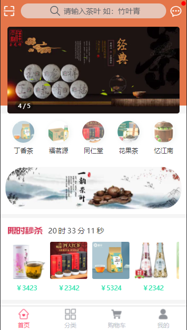

#### 介绍
基于uni-app开发的电商小程序

#### 软件架构
###### 语言:uni-app Vue2.0
###### UI:uview-ui2.0

#### 使用说明

##### 1.utils.js下env文件 index.js 选择对应环境的 api
##### 2.服务端项目接口地址启动方式参照：[服务端https://github.com/zhangbo126/express-mongoose-server](https://github.com/zhangbo126/express-mongoose-server)

##### 3.管理端后台系统操作参照：[管理平台https://github.com/zhangbo126/vue3-ant-design-vue3.0]([https://gitee.com/ZHANG_6666/crm-template](https://github.com/zhangbo126/vue3-ant-design-vue3.0))  

##### 4.界面

